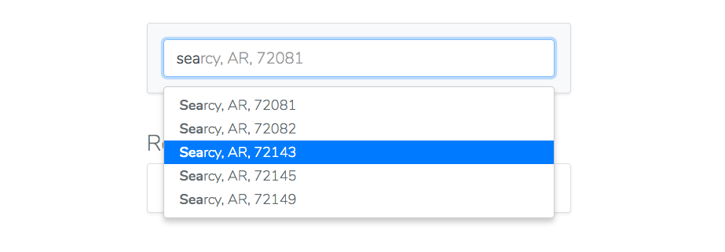

# :facepunch: Ez Geo Query
 
Ez Geo Query is an API service to provide autoresult suggestions for City, State, ZIP search string combinations. It returns data in a consistent format and is currently being developed to provide more data, such as population, median income, and latitude longitude coordinates. Using the typeahead library with the API allows for rapid setup and deployment of geographical autocomplete search fields. 


### Example

##### Query by City

```javascript
$.get(https://ezgeoquery.us/query/sea);
```

##### Response

```javascript
[ 
  { "zip_code": "61476", "city": "Seaton", "state": "IL" }, 
  { "zip_code": "61359", "city": "Seatonville", "state": "IL" }, 
  { "zip_code": "20743", "city": "Seat Pleasant", "state": "MD"}, 
  { "zip_code": "98032", "city": "SeaTac", "state": "WA"}, 
  { "zip_code": "98148", "city": "SeaTac", "state": "WA"} 
]
```


##### Query by Zip

```javascript
$.get(https://ezgeoquery.us/query/425);
```

##### Response

```javascript
[ 
  { "zip_code": "42501", "city": "Burnside", "state": "Kentucky" }, 
  { "zip_code": "42503", "city": "Burnside", "state": "Kentucky" }, 
  { "zip_code": "42518", "city": "Burnside", "state": "Kentucky" }, 
  { "zip_code": "42519", "city": "Burnside", "state": "Kentucky" }, 
  { "zip_code": "42544", "city": "Burnside", "state": "Kentucky" } 
]
```


## Ez Geo Typeahead

Ez Geo Typeahead is a typeahead library build on top of [typeahead.js](https://github.com/corejavascript/typeahead.js) using the [Ez Geo Query API](https://ezgeoquery.us/). It was designed to be a drop in, turn-key autocomplete solution for querying Zip Codes, Cities and States in the US. Under the hood it also uses the [Bloodhound engine](https://github.com/corejavascript/typeahead.js/blob/master/doc/bloodhound.md) to query the API.



**NOTE** This is using a *more recently maintained* fork of the original [Twitter Typeahead & Bloodhound](https://github.com/twitter/typeahead.js) repo.

### Demo

There is a simple demo in this repo you can clone and test. See `/demo` for a basic example with setup.

### Getting Started

Ez Geo Typeahead has dependencies on:

- jQuery (not slim)
- [typeahead.js](https://github.com/corejavascript/typeahead.js) ( bundle w/ Bloodhound)

The typeahead is built around Bootstrap styles, but does not require Bootstrap css or js. Bootstrap's recommended jQuery lib  is the `slim` version. This will not work, as slim does not contain the `ajax` module.

If you have the required libraries loaded, include [ezgeoquery-typeahead.js](https://github.com/nickrstan/ezgeoquery-typeahead/blob/master/dist/ezgeoquery-typeahead.js).

##### By Script

`<script type="text/javascript" src="ezgeoquery-typeahead.js"></script>`

##### NPM

`npm install ezgeoquery-typeahead`

### Get an API key

Head over to [Ez Geo Query](https://ezgeoquery.us) and sign up for *free* to get an API key.

### Init the library

In your script file, initialize the library with your new API key.

```javascript
var apikey = "YOUR-API-KEY";

// Init the library with your key
var ezgeo = EzGeoTypeahead.init(apikey);
```

### Make your inputs into a Typeahead

Take the input field you want to make a typeahead and pass it into the `make` method. Optionally you can provide [options](#typeahead-options) for this specific typeahead. See the list for default options and descriptions. 

```javascript
/** @see options */
var options = {
    selectFirstOnClose: true,
    setPreviousValueOnEmpty: true,
}
  
// You could pass in a string or a jQuery object
var $input = ezgeo.make('#ezgeo', options);
```

And thats it. Ez. :boom:	


## Typeahead Options

Under the hood, we configure most of the options for you. We feel these are opinionated, however we still have the following default options from [typeahead.js options](https://github.com/corejavascript/typeahead.js/blob/master/doc/jquery_typeahead.md#options) and our own custom ones. 

### [Options](https://ezgeoquery.us/#options)


## Typeahead Events

We pass the default events from [typeahead.js events](https://github.com/corejavascript/typeahead.js/blob/master/doc/jquery_typeahead.md#events) so you can still access them. All events will be accessed as:

```javascript
$input.typeahead.on('eventName', function() {});
```

**NOTE** Every event does not supply the same arguments. See the event descriptions above for details on each event's argument list.

### [Events](https://ezgeoquery.us/#events)


## Get the current value

There are a couple ways to get the current value. You can still rely on the current html input value, which would be the formatted selection; ex `Seattle, Wa, 98118`. If you want to get the value as an object, to send or trigger other events, you can access the current value of the input by an event, or directly.

```javascript
// To access directly from the getter
var value = $input.currentValue;
console.log(value);

// To access by the valueUpdated event
$input.typeahead.on('typeahead:valueUpdated', function(ev, value) {
    console.log(value);
});

// both would output from Searcy, AR, 72143
// { zip_code: "72143", city: "Searcy", state: "AR" }
```


## Typeahead Styles

There is a minimal style included inline. It should work pretty well with any input style. It would work best with a Bootstrap form-control. You can override these easily to match your current/desired style.

### [Default Style](https://github.com/nickrstan/ezgeoquery-typeahead/blob/master/src/style.css)


## Ez Geo API

Behind the typeahead library is the [Ez Geo API](https://ezgeoquery.us/). We've written algorithms to interact with our data in order to return city, state, zip results reliably and consistently, making building anything (such as registration forms with user's geographical data, address, etc.) that requires this data a breeze.

Below you can see the various search query combinations that the API accepts and will return results for. Our typeahead library also searches by partial match and allows you to enter a portion of any part of the combination, such as "Sea, WA 981" for Seattle, Washington locations whose zip start with 981XX.

### Getting Started

First, get your *free* API key from [Ez Geo API](https://ezgeoquery.us/). You can then begin to query our endpoints.

#### Authorization Header

Each request must contain your API key. Attach it in the header of your get request. 

```javascript
"x-authorization": <YOUR-API-KEY>
    
// In jQuery ajax
$.ajax({
    url: 'https://ezgeoquery.us/api/popular',
    headers: {
        'x-authorization':'<YOUR-API-KEY>'
    }
});
```

### Endpoints

Currently Ez Geo API has two endpoints available.

#### /popular

`https://ezgeoquery.us/api/popular`

Return the 50 most popular cities in the united states. This is used in the typeahead library to prefetch on initialization.

#### /query

`https://ezgeoquery.us/api/query/<query>`

Query a City, State or Zip with any of the following formats mentioned below. 

**NOTE** Currently the response will contain the top 5 hits for the query.

#### Formats that work with the query enpoint:

`City, State, Zip` - `City, Zip` - `State, Zip` - `City, State` - `City,` - `Zip` - `City` - `City State Zip` - `City Zip` - `State Zip` - `City State` - `City,State,Zip` - `City,Zip` - `City,State` - `City , Zip` - `City City, Zip`


## Development

We would gladly accept pull requests. 

- Clone the repo
- `npm install`
- See the `package.json` for scripts to run.
- run `npm run build:prod` to compile
- commit

## TODO

- [ ] Return results by population
- [ ] Send more data in the response
- [ ] More query options

## License

MIT
